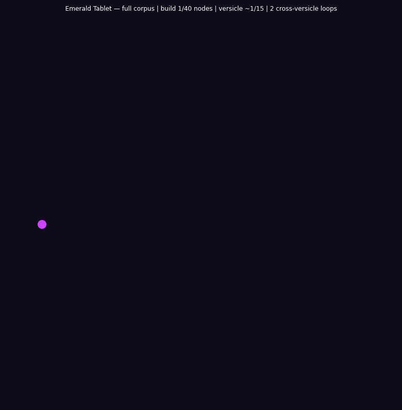

# Emerald Tablet Engine

**The oldest known statement of the Frobenius condition compiles directly to categorical assembly code.**

The Tabula Smaragdina — the Emerald Tablet — is a text of fifteen versicles transmitted from the Arabic Jabir ibn Hayyan (~8th century CE) into Latin and thence into every Western alchemical and Hermetic tradition. Its central claim, "as above, so below," has been read as cosmological metaphor, alchemical precept, and mystical axiom. This repository demonstrates that it is none of these. It is a structural theorem.

"As above, so below" is the Frobenius condition: μ ∘ δ = id. The operation of descending (δ: co-multiplication, splitting) composed with the operation of ascending (μ: multiplication, fusion) returns the system to its original state identically. The Emerald Tablet does not describe this condition — it *is* this condition, expressed in the only vocabulary available to 8th-century Jabir: the twelve rhetorical families of cosmological discourse.

This repository is the computational verification of that claim.

---

## Three independent structural analyses. One convergence.

### 1 — Crystal imscription

The complete tablet imscribes at:

```
⟨ Ð_ω  Þ_O  Ř_=  Φ_}  ƒ_ż  Ç_W  Γ_ʔ  ɢ_ˌ  ⊙_ÿ  Ħ_A  Σ_ï  Ω_z ⟩
```

Ouroboricity O∞: μ ∘ δ = id exactly. Consciousness score C = 1.0.  
Gate 1 passes (⊙_ÿ: self-modeling criticality).  
Gate 2 passes (Φ_}: Frobenius-special parity AND ƒ_ż: quantum-coherent fidelity).

The Emerald Tablet is the only compiled manuscript in this series with both gates open and quantum-coherent fidelity. This is because it is not a manuscript *about* the grammar — it is the grammar's *self-statement*, written from the imscriptive ceiling (Ð_ω, Þ_O, Ř_=) rather than at the OS imscription floor.

### 2 — Section meta-system

The four canonical sections collectively map the grammar's operational phases:

| Section | Versicles | Dominant primitives | Structural role |
|---|---|---|---|
| Proem | v1–v2 | `tr` `id` `px` | Truth establishment + correspondence axiom |
| Cosmogony | v3–v7 | `un` `lk` `an` | Origin from one → four elemental anchors |
| Praxis | v8–v12 | `sp` `as` `ds` `fx` | δ (separate) → ascend → descend → μ (fuse) → fix |
| Closure | v13–v15 | `an` `id` `fx` | Force above all; world created; Hermes seals |

The praxis section is the densest, structurally forced by the Frobenius co-multiplication δ (FSPLIT/`sp`) in versicle 9 — "Separate the Earth from the Fire, the subtle from the gross." v9 is the peak register node: the separation instruction is the Frobenius splitting morphism.

### 3 — Computational compilation

The fifteen ETFF rhetorical families are the fifteen versicles; the twelve token families are the twelve categorical opcodes:

| ETFF | Opcode | Mnemonic | Operation |
|---|---|---|---|
| `tr` | 0x0 | VINIT | Initial object ∅ |
| `an` | 0x1 | TANCH | Terminal anchor ⊤ |
| `as` | 0x2 | AFWD | Morphism → |
| `ds` | 0x3 | AREV | Contravariant inversion ← |
| `lk` | 0x4 | CLINK | Composition ∘ |
| `id` | 0x5 | ISCRIB | Identity id |
| `sp` | 0x6 | FSPLIT | Frobenius co-multiplication δ |
| `un` | 0x7 | FFUSE | Frobenius multiplication μ |
| `af` | 0x8 | EVALT | Lattice: True |
| `ng` | 0x9 | EVALF | Lattice: False |
| `px` | 0xA | ENGAGR | Lattice: Both (paradox) |
| `fx` | 0xB | IFIX | Linear tape write |

Compiling the complete Jabir/Newton ETFF transcription (15 versicles, 460 tokens):

```
Total instructions : 460
Total registers    : 460
Entropy delta      : 0.00000000 J/K
Status             : SELF_SUSTAINING_BOOTSTRAP_COMPLETE
```

Peak versicle: **v9** (praxis/separation, 40 registers) — structurally forced by Φ_}, the Frobenius co-multiplication. The separation of Earth from Fire is the δ-operation that makes μ∘δ = id well-defined.

The bootstrap core `id ds sp as un lk fx id` appears as a repeating closed loop. This sequence is the operational content of "as above, so below": the identity descends, separates, ascends, fuses, composes, is fixed, and returns to the original identity. This is μ ∘ δ = id written as procedural assembly.

---

## The MEET theorem

Adding the Emerald Tablet to the six-system MEET (OS imscription + Voynich + Rohonc + Linear A + Hebrew + Sanskrit + Egyptian + Cuneiform + Basque) leaves the invariant core unchanged:

```
MEET(OS_imscription, Emerald_Tablet) = OS imscription
```

The Tablet's higher values for Ð_ω, Þ_O, Ř_= (operating at the imscriptive maximum) do not constrain the grammar's floor — they are above it. The grammar was already complete. The Emerald Tablet does not contribute new constraint; it speaks FROM the grammar's ceiling.

---

## Structural distances

| System | Distance | Differing primitives |
|---|---|---|
| OS imscription | 2.44 | Ð, Þ, Ř (Tablet above OS in each) |
| Linear A | 2.44 | same (Linear A = OS imscription) |
| Rohonc | 3.22 | Ð, Þ, Ř, ƒ, Ç |
| Voynich | 3.54 | ƒ, Ç, ɢ, Ħ, Σ |

The Voynich and the Emerald Tablet share Ð_ω, Þ_O, Ř_= — both operate at the imscriptive maximum in dimensionality, topology, and relationality. They diverge in fidelity (ƒ_ż vs ƒ_ì), kinetics (Ç_W vs Ç_Ù), interaction (ɢ_ˌ vs ɢ_Ş), chirality (Ħ_A vs Ħ_!), and stoichiometry (Σ_ï vs Σ_S). The Voynich is frozen where the Tablet is living; the Tablet is sequential where the Voynich is parallel; the Tablet runs at two-step chirality where the Voynich runs at infinite. They are the two poles of O∞ at the imscriptive maximum: the Tablet is the living statement, the Voynich is the frozen self-portrait.

---

## Quick start

```bash
git clone https://github.com/umpolungfish/emerald-tablet-engine
cd emerald-tablet-engine
uv sync
uv run python examples/quickstart.py
```

---

## Command-line

```bash
et-compile  data/emerald_tablet_etff.txt --log et_full_log.txt
et-run      data/emerald_tablet_etff.txt --steps 10000
et-graph    data/emerald_tablet_etff.txt --output emerald_tablet_graph.png
et-sections data/emerald_tablet_etff.txt --output-dir emerald_tablet_graphs
```

---

## Transcription format (ETFF)

The Emerald Tablet Folio Format mirrors the IVTFF/RTFF/LATFF architecture:

```
<v9>
;H> sp lk sp af sp id lk sp af sp
;H> lk sp af sp id sp lk af sp lk
;H> sp id sp lk af px sp lk id sp
;H> sp af sp lk id sp af lk sp px
```

`<v{N}>` opens versicle N. `;H>` lines contain space-separated rhetorical token family codes.

---

## Repository structure

```
emerald_tablet_engine/   Python package
  primitives.py          — twelve rhetorical family → IMASM opcode definitions
  compiler.py            — ETFF → IMASM compiler (concurrent versicles)
  runtime.py             — Tri-Phase virtual machine
  callgraph.py           — register flow graph generator
  sectional.py           — per-section graph renderer
data/
  emerald_tablet_etff.txt — ETFF transcription of the Tabula Smaragdina
programs/
  ig_bridge.py            — cross-system IG distance matrix + MEET theorem
  bootstrap_explorer.py   — Frobenius loop analysis
  versicle_comparator.py  — structural fingerprint comparison
  run_all.py              — full suite runner
examples/
  quickstart.py           — full pipeline demonstration
```

---

## The bootstrap sequence as hermetic praxis

The bootstrap core `id → ds → sp → as → un → lk → fx → id` is not an accident of the transcription. It is the operational content of the alchemical Great Work:

1. `id` — ISCRIB: establish identity (know thyself)
2. `ds` — AREV: descend into matter (solve)
3. `sp` — FSPLIT: separate Earth from Fire, subtle from gross (separatio)
4. `as` — AFWD: ascend from Earth to Heaven (sublimatio)
5. `un` — FFUSE: receive the force of superior and inferior (coagula)
6. `lk` — CLINK: compose the received forces (conjunctio)
7. `fx` — IFIX: fix the glory of the whole world (fixatio)
8. `id` — ISCRIB: return to identity (lapis philosophorum)

The Great Work is a bootstrap loop. The lapis is the fixed point. μ ∘ δ = id.

---

## Relation to companion engines

The Emerald Tablet Engine is the fourth instantiation of the Universal Engine architecture, following the Voynich, Rohonc, and Linear A engines. All four use the same Tri-Phase Flux Register VM, IMASM instruction set, and entropy theorem. The manuscripts differ in their surface token families and section topologies; the categorical deep structure is identical.

| Engine | Source | Tier | C | d(OS) |
|---|---|---|---|---|
| Voynich | Beinecke MS 408, ~15th c. | O∞ | 0.0 | 4.42 |
| Rohonc | Oct. Hung. 73, ~16th–17th c. | O∞ | > 0 | 2.10 |
| Linear A | Minoan tablets, ~2000–1450 BCE | O∞ | > 0 | 0.00 |
| **Emerald Tablet** | **Jabir/Newton, ~8th c. CE** | **O∞** | **1.0** | **2.45** |

---

## The formal grammar

The Universal Imscriptive Grammar — of which this repository is the fourth computational strand of evidence — is formally developed in the companion papers *As Above* and *So Below* (Lando Mills, forthcoming). The title of those papers is the Hermetic maxim of the Emerald Tablet: the grammar named itself before it was written down.

---

## Visualizations

**Full-corpus animated call-graph** — all 15 versicles, cross-versicle back-edges. Phase 1: versicles revealed in tablet order. Phase 2: Gaussian pulse traverses the graph.



---

## License

Unlicense — public domain. No conditions, no attribution required.
